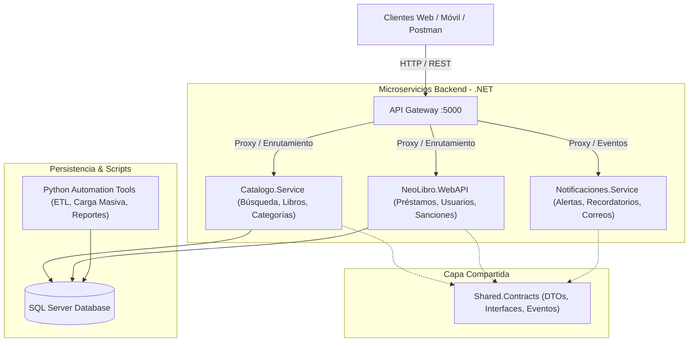

# NeoLibro - Sistema Distribuido de Gestión Bibliotecaria

[](https://dotnet.microsoft.com/)
[](https://learn.microsoft.com/en-us/dotnet/architecture/microservices/)
[](https://www.microsoft.com/sql-server)
[](https://www.docker.com/)
[](LICENSE)

Sistema distribuido diseñado para la administración integral de bibliotecas universitarias. Implementa una **arquitectura basada en microservicios desacoplados**, enrutamiento dinámico mediante **API Gateway**, contratos fuertemente tipados, persistencia en **Microsoft SQL Server** y soporte para contenedores **Docker**.

---

## Arquitectura del Sistema

El sistema sigue un patrón de **Microservicios con API Gateway** y separación de responsabilidades:



---

## Componentes y Módulos

| Componente | Puerto Default | Descripción Técnica |
| :--- | :---: | :--- |
| **`ApiGateway`** | `5000` | Punto de entrada unificado que gestiona el enrutamiento, balanceo de carga y políticas CORS. |
| **`Catalogo.Service`** | `5001` | Microservicio encargado del acervo bibliográfico, metadata de libros, autores, editoriales y control de ejemplares físicos. |
| **`NeoLibro.WebAPI`** | `5002` | Núcleo de operaciones de circulación: solicitudes de reserva, préstamos activos, devoluciones y penalidades. |
| **`Notificaciones.Service`** | `5003` | Servicio asíncrono para emisión de notificaciones de vencimiento, confirmación de reservas y alertas administrativas. |
| **`Shared.Contracts`** | — | Librería de clases compartida con modelos comunes, DTOs y validaciones para garantizar consistencia. |
| **`database/`** | `1433` | Scripts DDL/DML para SQL Server, procedimientos almacenados y scripts Python para seeding y diagnóstico. |

---

## Stack Tecnológico

- **Backend:** C# / .NET Core (WebAPI, Minimal APIs / Controllers).
- **Patrones:** Microservicios, API Gateway, Repository & Service Layer, Dependency Injection, DTO Pattern.
- **Base de Datos:** Microsoft SQL Server (Relational DB, Transact-SQL).
- **Automatización:** Python 3.10+ (Pandas, pyodbc, automatización de carga de catálogos).
- **Contenedores:** Docker & Docker Compose.
- **Testing & Tooling:** Postman Collections, herramientas CLI de diagnóstico SQL y verificación de endpoints.

---

## Guía de Instalación y Ejecución Local

### Prerrequisitos
- [.NET SDK 8.0](https://dotnet.microsoft.com/download) o superior.
- [Microsoft SQL Server](https://www.microsoft.com/en-us/sql-server/sql-server-downloads) (o Docker).
- [Python 3.10+](https://www.python.org/) (opcional, para utilitarios de datos).

### 1. Clonar el Repositorio
```bash
git clone https://github.com/Angelblazel/biblioteca-distribuida-microservicios.git
cd biblioteca-distribuida-microservicios
```

### 2. Configurar la Base de Datos
Ejecutar el script de base de datos en SQL Server Management Studio (SSMS) o mediante la terminal:
```sql
-- Ejecutar en SQL Server
database/BibliotecaFISI_Simplificado.sql
```
*(Opcional)* Cargar catálogo inicial de libros mediante el script de automatización:
```bash
cd database
pip install pyodbc
python cargar_datos_completos.py
```

### 3. Compilar la Solución .NET
```bash
cd backend
dotnet restore
dotnet build
```

### 4. Ejecutar los Microservicios
Puedes iniciar los servicios de forma individual o mediante Docker:

```bash
# Terminal 1 - ApiGateway
cd backend/ApiGateway
dotnet run

# Terminal 2 - Catalogo Service
cd backend/Catalogo.Service
dotnet run

# Terminal 3 - NeoLibro Core WebAPI
cd backend/NeoLibro.WebAPI
dotnet run

# Terminal 4 - Notificaciones Service
cd backend/Notificaciones.Service
dotnet run
```

---

## Endpoints Destacados

### Catálogo
- `GET /api/libros` - Búsqueda y filtrado de libros con paginación.
- `GET /api/libros/{id}` - Detalle y disponibilidad de ejemplares en tiempo real.
- `POST /api/libros` - Registro de nuevos títulos (Admin).

### Circulación & Préstamos
- `POST /api/prestamos/solicitar` - Generación de solicitud de préstamo de ejemplar.
- `PUT /api/prestamos/devolver/{id}` - Procesamiento de retorno de material y cálculo de mora.
- `GET /api/usuarios/{id}/historial` - Historial de lecturas y préstamos activos.

---

## Autor y Contacto

- **Ángel César Obregón Blaz** — *Ingeniería de Sistemas (UNMSM)*
- **GitHub:** [Angelblazel](https://github.com/Angelblazel)
- **LinkedIn:** [Ángel Obregón](https://linkedin.com/in/)
